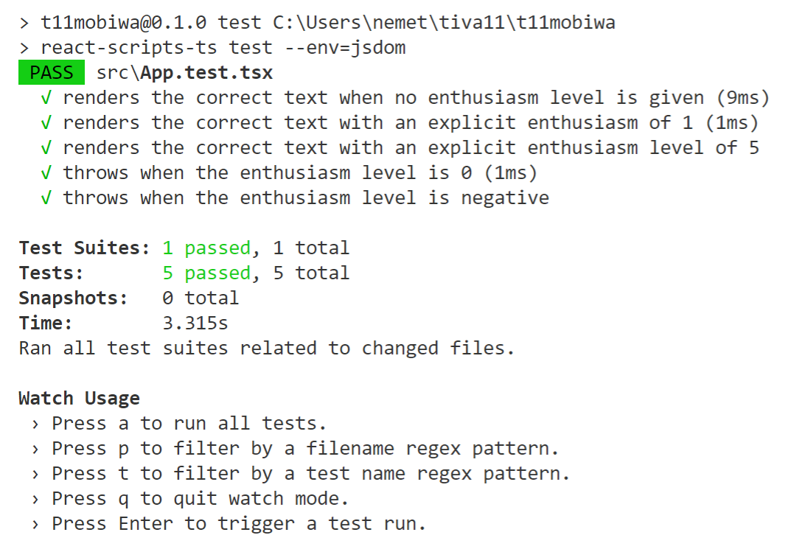

# t11mobiwa
An experimental mobile warehousing solution for SAP B1 using Design1st TDD on React/Redux/TypeScript/Material-UI/PWA

## React JSX Supports Type Validation
For [TypeScript](https://www.typescriptlang.org/samples/index.html) integration anterribly important feature of React is that its JSX you will have full support for type validation; Vue templates type checking doesn't work at all, which definitely a deal breaker. I hev worked a lot with Flow, but the checking process of Flow is terrby slow. 

Here is a list of guidelines to start with React/TypeScript:
- [Microsoft TypeScript React Starter with create-react-app my-app --scripts-version=react-scripts-ts](https://github.com/Microsoft/TypeScript-React-Starter) Despite I was able to use successfully the getting started tutorial of this project -- see my videos, comments and [accompanying repository branch t11mobiwa/gettingstarted on GitHUb](https://github.com/nemethmik/t11mobiwa/tree/gettingstarted) --, as well as react-script-ts to create a TS project, Microsoft/TypeScript-React-Starter is regarded __deprecated__, maybe only by some people, see [Please Archive this Project](https://github.com/Microsoft/TypeScript-React-Starter/issues/166#issuecomment-448377712). Facebook's Create React App project has direct support for [initializing a project with TypeScript](https://github.com/facebook/create-react-app/pull/5550), and the only thing to do is to use **npx create-react-app my-app --typescript** 
- [Best Practices for Using TypeScript with React by Christopher Diggins (Clemex)](https://medium.freecodecamp.org/effective-use-of-typescript-with-react-3a1389b6072a) - This was a migration project from JavaScript, so some of their recommendations may not be applicable for a Design-1st TypeScript project. They have published a template project on GitHub, too; see below.
- [A Template for TypeScript Projects using React and Redux by by Christopher Diggins (Clemex)](https://github.com/Clemex/typescript-react-template) Unfortunately, this template project doesn't compile, so I had no chance to experiment with it. The issue (including me) has been reported on GitHub by multiple users. 
- [React & Redux in TypeScript - Static Typing Guide by Piotr Witek](https://github.com/piotrwitek/react-redux-typescript-guide) This is quite actively maintained project
- [React Higher-Order Components in TypeScript by James Ravenscroft](https://medium.com/@jrwebdev/react-higher-order-component-patterns-in-typescript-42278f7590fb)
- [How to improve the build speed in React-Typescript, when using Material UI](https://dev.to/janpauldahlke/how-to-improve-material-ui-speed-in-react-typescript-1199)
- [Material UI Admin (anything/anything)](https://material-ui-admin.herokuapp.com/account/login?redirect=%2F) The GitHub project is [A boilerplate for React using Typescript, Material UI and Redux, React Router](https://github.com/goemen/react-material-ui-typescript); it compiles and runs fine on my system, too. However, after npm update, it stops compiling. 
- [Material UI Guide for TypeScript](https://material-ui.com/guides/typescript/)
- [Material UI Type Definitions on NPM](https://www.npmjs.com/package/@types/material-ui)  
- [Getting Started With React, TypeScript MobX, and Webpack 4](https://medium.com/teachable/getting-started-with-react-typescript-mobx-and-webpack-4-8c680517c030) MobX is said to be written in TypeScript.

## Installation
- **npx create-react-app t11mobiwa --typescript** 
  - npx create-react-app t11mobiwa --scripts-version=react-scripts-ts is regarded as deprecated. Actuall, both --typescript and --scripts-version=react-scripts-ts do (nearly) exactly the same thing, at lreast from the perspective of the source code components relevant to the GitHUb repository.
- cd t11mobiwa && npm start

Create React App with React Scripts TS created a project initialized for TS, and unlike Vue/TS it compiled cleanly. Instead of js/jsx, tsx files were created. The deprecated react-scripts-ts would create a gigantic README, which I renamed to README.react-scripts.md. 
```
c:\Users\nemet\tiva11\t11mobiwa>npm start
> t11mobiwa@0.1.0 start c:\Users\nemet\tiva11\t11mobiwa
> react-scripts-ts start
Starting type checking and linting service...
Using 1 worker with 2048MB memory limit
Watching: c:\Users\nemet\tiva11\t11mobiwa\src
Starting the development server...
ts-loader: Using typescript@3.2.2 and c:\Users\nemet\tiva11\t11mobiwa\tsconfig.json
Compiled successfully!
You can now view t11mobiwa in the browser.
  Local:            http://localhost:3000/
  On Your Network:  http://192.168.50.36:3000/
Note that the development build is not optimized.
To create a production build, use npm run build.
```
## Getting Started
### TSLint and Hello Components
I created a new branch for experimenting with TypeScript following the instructions [TypeScript React Starter](https://github.com/Microsoft/TypeScript-React-Starter).
After I modified some of the files, I received a couple of error messages from TSLint
- [interface-name:interface name must start with a capitalized I](https://palantir.github.io/tslint/rules/interface-name)
- [comment-format:comment must start with a space](https://palantir.github.io/tslint/rules/comment-format)
- [member-access:The class method 'render' must be marked either 'private', 'public', or 'protected'](https://palantir.github.io/tslint/rules/member-access/)
- [max-classes-per-file:A maximum of 1 class per file is allowed](https://palantir.github.io/tslint/rules/max-classes-per-file/)
- [ordered-imports:Import sources within a group must be alphabetized](https://palantir.github.io/tslint/rules/ordered-imports/)
- [member-ordering:Declaration of public instance method not allowed after declaration of private instance method](https://palantir.github.io/tslint/rules/member-ordering/)
- [object-literal-sort-keys:The key 'input' is not sorted alphabetically](https://palantir.github.io/tslint/rules/object-literal-sort-keys/)
- [jsx-boolean-value:Value must be set for boolean attributes](https://www.npmjs.com/package/eslint-plugin-react)
- [noUnusedLocals (in tsconfig):'something' is declared but its value is never read.](https://github.com/Microsoft/TypeScript/issues/12913) VERY IMPORTANT to kill **npm start** to enforce it to reread tsconfig. The option no-unused-variable is deprecated and has no effect any more.
- [interface-over-type-literal:Use an interface instead of a type literal](https://palantir.github.io/tslint/rules/interface-over-type-literal/) I think Type Script [type aliases](https://www.typescriptlang.org/docs/handbook/advanced-types.html) are powerful enough and this rure is pretty pointless. 
-[jsx-no-lambda:Lambdas are forbidden in JSX attributes due to their rendering performance impact](https://github.com/wmonk/create-react-app-typescript/issues/370)
-[no-console:Calls to 'console.log' are not allowed](https://palantir.github.io/tslint/rules/no-console/)

Instead of disabling these globally, I have disabled some of them in the header part of the file:
/* tslint:disable:max-classes-per-file comment-format */
So, my first impressions with TS are really great, the compilation is absolutely fast and integrated into the save/recompile/automated-rerender-in-browser process
It's a pity, I spent so much time on Flow, TypeScript is a lot more mature.
### Testing Hello Components
The instructions came from [Testing with Jest](https://github.com/Microsoft/TypeScript-React-Starter#writing-tests-with-jest)
- **npm install --save-dev enzyme @types/enzyme enzyme-adapter-react-16 @types/enzyme-adapter-react-16 react-test-renderer**
- npm run test

Since we use Create React App, we can create a src/setupTests.js and put inside it the Enzyme initialization code. CRA will tell Jest to load it before each of your tests automatically.
Everything worked amazingly.
<br/>

### Redux
- **npm install redux react-redux @types/react-redux**  In this case we didn't need to install @types/redux because Redux already comes with its own definition files (.d.ts files).

Dispatch is no longer part of the react-redux library. Replace import { connect, Dispatch } from 'react-redux' with
```
import { connect } from 'react-redux';
import { Dispatch } from 'redux';
```
I have completed the entire React/TypeScript getting started tutorial, and I am really impressed. I'd never go back to Flow and especially not to bare-bones JavaScript.

## Adding Material UI
We have two starter/template projects on GitHUb to use as samples. I'd simply add Material UI as a regular package along with TypeScript type definitions, and then simply copy pasting blocks from these templates, I'll elaborate a working Material UI version. 
### Following Instructions on [Material UI](https://material-ui.com/getting-started/installation/)
- Add ```<link rel="stylesheet" href="https://fonts.googleapis.com/css?family=Roboto:300,400,500">``` and ```<link rel="stylesheet" href="https://fonts.googleapis.com/icon?family=Material+Icons">``` to public/index.html
- **npm install @material-ui/core @material-ui/icons prop-types @types/prop-types** Prop Types was used in a number of Material UI examples. 

### Prop Types Definitions Must Be Compatible with TypeScript Definitions for Properties
I was fighting about two hours to get rid of the compiler error. 
```
C:/Users/nemet/tiva11/t11mobiwa/src/ui/AppBar.tsx
(224,55): Argument of type 'typeof PrimarySearchAppBarComponent' is not assignable to parameter of type 'ComponentType<ConsistentWith<IPrimarySearchAppBarComponentProps, { classes: Record<"search" | "title" | "root" | "grow" | "menuButton" | "searchIcon" | "inputRoot" | "inputInput" | "sectionDesktop" | "sectionMobile", string>; innerRef?: ((instance: any) => void) | ... 2 more
... | undefined; }>>'.
  Type 'typeof PrimarySearchAppBarComponent' is not assignable to type 'ComponentClass<ConsistentWith<IPrimarySearchAppBarComponentProps, { classes: Record<"search" | "title" | "root" | "grow" | "menuButton" | "searchIcon" | "inputRoot" | "inputInput" |
"sectionDesktop" | "sectionMobile", string>; innerRef?: ((instance: any) => void) | ... 2 more ... | undefined; }>, any>'.
    Types of property 'propTypes' are incompatible.
      Type '{ classes: Validator<object>; title: Requireable<string>; }' is not assignable to type 'WeakValidationMap<ConsistentWith<IPrimarySearchAppBarComponentProps, { classes: Record<"search" | "title" | "root" | "grow" | "menuButton" | "searchIcon"
| "inputRoot" | "inputInput" | "sectionDesktop" | "sectionMobile", string>; innerRef?: ((instance: any) => void) | ... 2 more ... | undefined; }>>'.
        Types of property 'title' are incompatible.
          Type 'Requireable<string>' is not assignable to type 'Validator<string>'.
            Types of property '[nominalTypeHack]' are incompatible.
              Type 'string | null | undefined' is not assignable to type 'string | undefined'.
                Type 'null' is not assignable to type 'string | undefined'.
```
When I commented out the propType definitions, compilation was OK.
It was my mistake, the Prop Types definitions should match. In this example the title is defined mandatory in the TypeScript definition, but optional in Prop Types definition: 
```
type PrimarySearchAppBarComponentProps = {
  classes?:any,
  title:string
}
class PrimarySearchAppBarComponent extends React.Component<PrimarySearchAppBarComponentProps> {
  public static propTypes = {
    classes: PropTypes.object.isRequired,
    title:PropTypes.string,
  }
  ...
```
If you add isRequired to the Prop Types definition for title the compilation error goes away. Or, make the title optional in the TypeScript definition. It is allowed however, that you have optional type definitions in TypeScript, but required in Prop Types.
The option **@ts-ignore** can be used to prevent error checking for the next line.

### Adding Primary Search App Bar
From the Materual UI [AppBar demo page](https://material-ui.com/demos/app-bar/) I have added PrimarySearchAppBar example. I've learned that styles are used in nearly every example. In this example styles were required for the search field, but not for the others. I definitively don't really like this approach, I'd prefer easy to use and customizable UI component library. CSS/JSS is anything but easy to use, especiually at this level. I'd prefer a ready-made set of components. Vuetify was a very nice example, it required no CSS at all, still its components worked great out of the box.
The Material Components (MDC) for React library was terribly complex to use; it had near zero documentation, no samples, and it was meant to be used with SASS.

On the other hand, after experimenting with the styles, it's really not that hard, if you have a working example to tweak and adjust. CSS is the engine of styling, so it's quite reasonable to include it in an easy to adjustable way, and this JSS style is really powerful, no need for SASS.

The setState React function can be called with a callback function. This is necessary only when after setting the state we want the updated state values, since setState is an async call. See [When to use React setState callback](https://stackoverflow.com/questions/42038590/when-to-use-react-setstate-callback)

### Clemex Single Page Layout Sample
After reading the [Best practices for using Typescript with React](https://medium.freecodecamp.org/effective-use-of-typescript-with-react-3a1389b6072a) I've checked out the accompanying starter project [typescript-react-template](https://github.com/clemex/typescript-react-template), which didn't compile, but out of curiosity, I've copied the seemed-to-be-interesting UI parts into a SimplePageLayout.tsx
It was really a waste of time, but I was happy that I was able to cut out the UI parts from the overcomplicated sample. I think these guys used TypeScript totally wrong, it just overcomplicated their life, it gave no help. TypeScript is a lot more complex type system than a regular typed programming language; it is as complex as C++ templates were. 
Here are a couple of interesting solutions I've learned from this exercise:
- Using some basic theming; the app component had a field **theme** of Theme in the state, and Material UI automatically applied that theme.
- Using Paper gave a nice partitioning effect to the screen, like a (grouping) panel/canvas.
- SimplePageLayout received three ReactNode properties: sidebar, header, main, and it composed the screen from these elements. It looks nifty, but, I am not sure, if it's any more flexible than simply building each screen from standard components, like: &lt;App>&lt;ActionButtons>&lt;ProcessBar>&lt;Your Content Comes Here>

### Using Material UI Type Definitions for Styles
The other major thing to learn the quite nifty/tricky type definitions for the HOC withStyle that injects a classes property into the props of the wrapped class. In the exanple beow CounterDisplayStyleKeys is a list of the string keys in the **classes** field actually injected by the HOC withStyle. The generic type **StyleRules&lt;CounterDisplayStyleKeys>** from @material-ui/core/styles guarantees, that the names in the counterDisplaystyles matches the field names defined in CounterDisplayStyleKeys. CounterDisplayStyleShape is for the (optional) run-time type checking via Prop-Types. Actually, it's totally reduntant to add Prop-Types next to TypeScript, so this is just for experimenting. TCounterDisplayProps is the props type definition which is and-ed together with **WithStyles** from @material-ui/core as **TCounterDisplayProps & WithStyles&lt;CounterDisplayStyleKeys>** to get the full definition of the props fields. **CounterDisplayWithStyles** is the component actually embedded in parent components.
```
type CounterDisplayStyleKeys = "root" | "anotherStyle"
export const counterDisplaystyles: StyleRules<CounterDisplayStyleKeys> = {
  root: {backgroundColor: 'lightGray',fontWeight: 'bold',padding: 5},
  anotherStyle: {padding: 5}
}
const CounterDisplayStyleShape = {
  root: PropTypes.string.isRequired,
  anotherStyle: PropTypes.string.isRequired,
}
export type TCounterDisplayProps = {
  value: number;
  label: string;
}
export class CounterDisplay extends React.PureComponent<TCounterDisplayProps & WithStyles<CounterDisplayStyleKeys>> {
  public static propTypes = {
    classes: PropTypes.shape(CounterDisplayStyleShape).isRequired,
    label:PropTypes.string.isRequired,
    value:PropTypes.number.isRequired,
  }
  public render(): React.ReactNode {
     return (
        <Typography className={this.props.classes.root} variant="h6">
          The current counter is:{this.props.label} = {this.props.value}
        </Typography>
    )
  }
}
export const CounterDisplayWithStyles = withStyles(counterDisplaystyles)(CounterDisplay);
export class Counter extends React.PureComponent {
  public render() {
    return (
       <Paper elevation={4}>
        <div>
          <CounterDisplayWithStyles value={11} label="Label XXX"/>

```
I think this is a total overkill: first, we don't need PropTypes, along with TypeScript. It's quiterare when we really need withStyles, which would make full typing of props complex.

### Traversy React & Material UI Project Using The PixaBay API
Since Traversy in his [React & Material UI Project Using The PixaBay API](https://www.youtube.com/watch?v=dzOrUmK4Qyw) used the old version of Material UI, see [Migration from v0.x](https://material-ui.com/guides/migration-v0x/#migration-from-v0-x), I was about to give, but eventually I went on and I remade his sample, which is not bad, actually. His architecture is a total mess, he doesn't even understand what is the difference between a static constant, a prop or a state, what he did was a total mess, but the idea was really great, and it was challenging to remake his mess into a proper application.
I've registered at Pixabay and I received my [API key](https://pixabay.com/api/docs/). The API is free but they want their [logo](https://pixabay.com/static/img/public/leaderboard_b.png) to get included. Traversy simply ignored this wish of the Pixabay people.

I've implemented the entire solution in a single file: PixabayImageFinder.tsx. 
The AppBar default position is fixed, which is totally wrong. The position should be static or relative, if you want to let the app bar scroll out when the user scrolls down. Or, **sticky** to get the usual non-scrolling app-bar feature.
With Toolbar style={{**minHeight:40,maxHeight:40**}} I was able to make the tool-bar narrower.
The [deprecated typography variants](https://material-ui.com/style/typography/#deprecated-variants) shouldn't be used, otherwise we get browser console warnings.
Traversy should have read the official [Thinking in React](https://reactjs.org/docs/thinking-in-react.html), which gives an example that has exactly the same concepts as the Pixabay Image Finder sample; so. I have rearchitected the application accordingly.
The application UI has a structure:
- Pixabay Finder (the application responsible for the application state)
  - Search Bar section (these should propagate the state change up to the application)
    - Search text field
    - Number of imeges to query selection box
  - List of Images
    - An image tile in the list
    - A modal dialog to show the details of the image full screen 
In the Thinking in React sample, the parent/container component (Filterable Product Table) passes callback functions (handleFilterTextChange, handleInStockChange) to the Search Bar component for state management; the Search Bar simply calls back these functions. The (application logic orchestrator) parent component passes these filter details (filter-text and is-stock-only) down to the product table as props along with the products. This is very much in-sync with the BL-AL-IScreenEvents-IScreenCommands architecture I've designed for BX mobile applications back in 2012, 6 years ago.
```
class FilterableProductTable extends React.Component {
  constructor(props) {
    super(props);
    this.state = {
      filterText: '',
      inStockOnly: false
    };
    this.handleFilterTextChange = this.handleFilterTextChange.bind(this);
    this.handleInStockChange = this.handleInStockChange.bind(this);
  }
  handleFilterTextChange(filterText) {
    this.setState({
      filterText: filterText
    });
  }
  handleInStockChange(inStockOnly) {
    this.setState({
      inStockOnly: inStockOnly
    })
  }
...
class SearchBar extends React.Component {
  constructor(props) {
    super(props);
    this.handleFilterTextChange = this.handleFilterTextChange.bind(this);
    this.handleInStockChange = this.handleInStockChange.bind(this);
  }
  handleFilterTextChange(e) {this.props.onFilterTextChange(e.target.value);}
  handleInStockChange(e) {this.props.onInStockChange(e.target.checked);}
...
class ProductTable extends React.Component {
  render() {
    const filterText = this.props.filterText;
    const inStockOnly = this.props.inStockOnly;  
```
In Pixabay Finder the AL object is responsible for performing the query. Of course, a BL abstraction would be necessary, but for this simple example AL would do BL tasks.
An interesting question, who is in charge of opening the Image Details Dialog? Since AL is responsible for all decisions for orchestration, AL would be the most appropriate component to open the image details dialog; this would give the possibility to extend the dialog with a lot more functionality later  without rearchitecting. On the other hand, you (just like Traversy) can regard this dialog as inherent/natural feature/part of the Image List. 

## Pixabay Finder V2 with New TypeScript Startup Project
A new branch is created: pixabayfinder2 for the new tasks of the sprint. 
First, I'll recreate and reinitialize the project with **npx create-react-app t11mobiwa --typesxript**, and move the source codes over to this project. Thereafter I'll perform the rearchitecting modifications that I have already planned and designed.